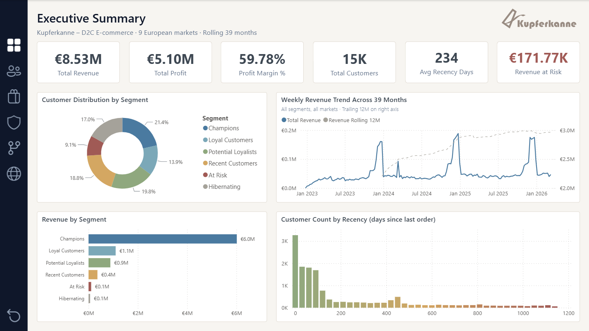

# Kupferkanne – RFM Customer Segmentation

**End-to-end customer analytics: a BigQuery warehouse, a Kimball star schema, and a Power BI semantic model shipped as code.**

[](CHANGELOG.md)
[](LICENSE)
[](docs/architecture.md)
[-F2C811)](pbip/)
[](.sqlfluff)

Fifteen thousand customers, one retention budget. This project is what the analytics behind that allocation decision looks like when it is engineered end to end: which customers to invest in, which products actually make money, and how much revenue is quietly walking out the door. The company – Kupferkanne, an Erlangen-based direct-to-consumer coffee-equipment brand selling across nine European markets – is fictional. The engineering is not: every number on the dashboard traces back through a documented, linted, regression-checked pipeline that lives in this repository.



> **Reviewing in 60 seconds?** Skim [the seven report pages](#the-report-seven-pages), read the scoring logic in [`docs/methodology.md`](docs/methodology.md), open one measure in [`pbip/`](pbip/) to see the model-as-code format, and read one decision in [`docs/adr/`](docs/adr/). That is the project in miniature.

---

## The problem

A retailer with a fixed marketing budget cannot spend uniformly across 15,000 customers – some are worth protecting, some are worth winning back, and some are not worth the spend. Kupferkanne turns that intuition into three answerable questions:

1. **Investment** – which customers deserve disproportionate retention spend, and why?
2. **Profitability** – which products and brands actually drive margin, under which definition of margin?
3. **Risk** – how much revenue sits in disengaging customers, and what is the upside of acting on it?

Each question maps to specific report pages, and every figure on those pages is reproducible from the SQL in this repo.

## The system

```
+------------------+     +------------------+     +------------------+
|  synth-datagen   |---->|     BigQuery     |---->|     Power BI     |
|  (Python CLI)    |     |  data warehouse  |     |   Import mode    |
|                  |     |    9-step SQL    |     |   PBIP / TMDL    |
+------------------+     +------------------+     +------------------+
  80 CSV shards           audit -> clean ->         7-page report
  ~460K raw records       EDA -> RFM -> marts       109 DAX measures
  seeded defects          Kimball star schema       model as code
```

| Scale | Value |
|---|---|
| Revenue | EUR 8,531,365.52 |
| Profit | EUR 5,100,089.72 (weighted margin 59.78%) |
| Customers | 14,967 scored |
| Orders | 168,777 order-grain rows; ~275K line-grain rows |
| Catalogue | 60 products, 5 brands, 6 categories |
| Window | 2023-01 to 2026-03 (39 months), 9 European markets |
| Semantic model | 109 DAX measures, 12 tables, 7 relationships (all single-direction) |

## The method

**RFM segmentation.** Every customer is scored 1–5 on Recency, Frequency and Monetary value using `NTILE(5)` quintiles with deterministic tiebreakers, summed into a composite score (3–15) and banded into six segments – Champions, Loyal Customers, Potential Loyalists, Recent Customers, At Risk, Hibernating – each mapped to a recommended marketing action. Recency is anchored to `MAX(OrderDate)` rather than `CURRENT_DATE()`, so results are reproducible on a frozen dataset; quintile scoring is distribution-adaptive, so thresholds move with the data instead of hard-coding euro cutoffs. ([ADR 0006](docs/adr/0006-rfm-segmentation-with-ntile.md))

**Two-tier margin.** Profitability is reported two ways on purpose: weighted (`SUM profit / SUM revenue` = 59.78%) and equal-weight across brands (59.94%). Today the two sit within 0.16 pp of each other – the dual view is the guard that keeps a future mix shift from hiding behind a single number. Both figures are labelled wherever they appear. ([ADR 0007](docs/adr/0007-two-tier-margin-calculation.md))

**Dual-grain model.** A Kimball star schema with conformed dimensions and two fact grains: order-grain `sales_curated` (168,777 rows) for revenue and segmentation, line-grain `v_items_for_bi` (~275K rows) for product detail. Measure names carry the grain (`[Total *]` vs `[Line *]`), and a reconciliation measure asserts the two grains agree (invariant = 0). ([ADR 0005](docs/adr/0005-dual-grain-fact-model.md))

## The report (seven pages)

| # | Page | The question it answers |
|---|---|---|
| 1 | Executive Summary | Is the business healthy, and where should attention go first? |
| 2 | Segment Deep Dive | Who are the six segments, and how do their R/F/M profiles differ? |
| 3 | Product & Brand | Where is profit actually made – and under which margin definition? |
| 4 | Churn Risk & What-If | How much revenue is at risk, and what is the upside of acting? A live reactivation parameter prices the scenario on the page. |
| 5 | Customer Lifecycle Intelligence | How does value concentrate and retain over time? Pareto by customer decile, cohort retention, RFM distribution map. |
| 6 | Regional Analysis | How do the nine markets compare? Includes a Deneb / Vega-Lite choropleth. |
| 7 | Customer Drillthrough (hidden) | What does one specific customer look like? Reached by drillthrough from any customer context. |

## Built like production

- **Model as code.** The Power BI model ships in PBIP/TMDL format: 109 measures, 12 tables and 7 single-direction relationships live as plain text, diffable and reviewable like any other source. [`docs/measures.md`](docs/measures.md) is the synced catalogue, kept honest by a standing rule: any model change triggers a Best Practice Analyzer run and a docs sync in the same session.
- **SQL that expects to be re-run.** Nine idempotent GoogleSQL scripts (audit → standardise → clean → validate → EDA → RFM transform → line-grain BI fact → BI customer dimension → analytics marts), SQLFluff lint-clean under a documented exception policy. Exploration runs *before* transformation, so segmentation thresholds come from observed distributions, not assumptions. ([ADR 0003](docs/adr/0003-pipeline-order-eda-before-transform.md))
- **Regression invariants.** Canonical KPIs (Revenue 8,531,365.52 / Customers 14,967) are baselined and re-asserted after pipeline changes – a refactor cannot silently bend a number.
- **Decisions on the record.** Fourteen architecture decision records, including two that were later superseded and deliberately kept in place – the model's history is part of the artifact. ([`docs/adr/`](docs/adr/))
- **Dirty data on purpose.** The source is generated by [synth-datagen](https://github.com/ryszard-twardy/synth-datagen) with seeded real-world defects – duplicate orders, cents-format inconsistency, orphan keys, type drift, header-row contamination – so the cleaning layer solves problems that actually occur in production. ([ADR 0008](docs/adr/0008-synthetic-data-with-realistic-quality-issues.md))

## Engineering workflow

Development follows a deliberately designed, AI-assisted workflow with the engineer in full control. The data model, segmentation methodology, and every analytical decision are the engineer's own, and every measure and query shipped is understood, reviewed, and defensible line by line. A coding agent (Claude Code) handles mechanical execution – scripted edits, most git operations, parts of the BigQuery DDL – but only inside an operator-gated process where every commit, push, and schema change is individually approved, with commit and push kept as separate steps. Quality controls are systematic rather than ad hoc: serialized report state (PBIP/TMDL) is reviewed hunk-by-hunk after each Power BI Desktop session, tool-induced churn is classified against a known allowlist before staging, architectural decisions are captured as ADRs, and documentation is reconciled against live model and warehouse state at session close. The AI accelerates execution; the operator owns every decision that mutates the repository.

## Repository map

| Path | Contents |
|---|---|
| [`sql/`](sql/) | Nine-step BigQuery pipeline, numbered in execution order (`00_0` audit → `05` marts) + 2 standalone analytical views |
| [`pbip/`](pbip/) | Power BI project: report definition (PBIR) + semantic model (TMDL) |
| [`graphics/`](graphics/) | Navigation icons (SVG): four states for each of the six navigable pages, plus a reset control and the icon-set license |
| [`theme/`](theme/) | Power BI report theme: `rfm_dashboard_theme.json` |
| [`docs/`](docs/) | `architecture.md`, `data_model.md`, `methodology.md`, `measures.md`, `glossary.md`, `adr/` |
| [`notebooks/`](notebooks/) | Quarto EDA notebook – analytical companion to the SQL EDA views |
| [`harness/`](harness/) | KPI regression harness – baseline + verify for the canonical KPIs |
| [`scripts/`](scripts/) | BigQuery loader (schema-enforced ingest) |
| [`data/`](data/) | Source CSV shards (80 files, committed for reproducibility) |
| [`tools/`](tools/) | Diagnostic DAX and SQL queries (`queries/`) + Tabular Editor batch scripts + a SQL whitespace utility |

## Reproduce it

1. **Generate the data.** [synth-datagen](https://github.com/ryszard-twardy/synth-datagen) produces the 80 CSV shards deterministically from a seed (~460K records, ~22 MB).
2. **Load to BigQuery.** One dataset (`kupferkanne-2026.sales`) with monthly-sharded fact tables (`orders20YYMM`, `items20YYMM`) plus two dimension tables. Load them with `scripts/upload_to_bigquery_schema_enforced.py`, passing `--data-dir data --project kupferkanne-2026 --dataset sales --location EU`. The project runs with billing enabled and the dataset carries no default table or partition expiration, so warehouse tables persist between pipeline runs ([ADR 0015](docs/adr/0015-warehouse-table-retention.md)).
3. **Run the pipeline.** Execute the `sql/` scripts in numeric order. Every script is idempotent (`CREATE OR REPLACE` for views, `DROP TABLE IF EXISTS` + `CREATE TABLE` for partitioned tables), so re-runs are safe.
4. **Open the report.** Open the `.pbip` in Power BI Desktop, authenticate the BigQuery connector (OAuth), and refresh.

## Scope, honestly

- The company and its data are synthetic by design; the figures are real outputs of the pipeline, not market claims.
- The pipeline runs manually per session. Orchestration (Dataform, dbt) was considered and consciously deferred – see the [CHANGELOG roadmap](CHANGELOG.md).
- The What-If reactivation scenario is first-order and gross (no discount netting); it is labelled as a scenario, not a forecast, wherever it appears.
- Import mode and a single-developer workflow: simplicity was chosen over enterprise plumbing wherever the plumbing adds no analytical signal.

## Documentation

| Document | What it covers |
|---|---|
| [`docs/architecture.md`](docs/architecture.md) | System overview, tech stack, pipeline flow |
| [`docs/data_model.md`](docs/data_model.md) | Star schema, ERD, table specifications |
| [`docs/methodology.md`](docs/methodology.md) | RFM approach, segmentation, margin calculation |
| [`docs/measures.md`](docs/measures.md) | Full DAX measure catalogue (109 measures) |
| [`docs/glossary.md`](docs/glossary.md) | Domain terminology |
| [`docs/adr/`](docs/adr/) | Fourteen architecture decision records |
| [`CHANGELOG.md`](CHANGELOG.md) | Release history and roadmap |

---

**Ryszard Twardy** – Data Analyst, Erlangen (DE)
[LinkedIn](https://linkedin.com/in/ryszard-twardy/) · [GitHub](https://github.com/ryszard-twardy)
