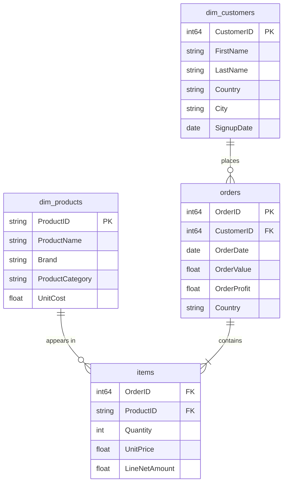

# Data Model

A Kimball-style dimensional model with two conformed dimensions and two fact tables sharded by month, plus a dual-grain semantic layer for Power BI consumption. Architectural rationale lives in [ADR 0004](adr/0004-star-schema-with-conformed-dimensions.md) (schema choice) and [ADR 0005](adr/0005-dual-grain-fact-model.md) (dual-grain design).

## Star schema

## Tables

### Dimensions

| Table | Rows | Purpose |
|---|---|---|
| `dim_customers` | ~15,000 | Customer master with country, city, signup date |
| `dim_products` | 60 | Product catalogue across 5 brands and 4 categories |

### Facts (sharded by month, Jan 2023 – Mar 2026)

| Pattern | Total rows | Grain | Purpose |
|---|---|---|---|
| `orders20YYMM` | ~169,000 across 39 shards | Order | Header-level transactions |
| `items20YYMM` | ~275,000 across 39 shards | Line item | Product-level detail |

Sharding by month allows BigQuery to prune scans when querying date ranges. Single-month queries hit one shard; cross-period queries use wildcard tables (`orders20*`).

## BI semantic layer

Two curated fact objects feed Power BI, each at a different grain:

| Object | Grain | Rows | Used by PBI pages |
|---|---|---|---|
| `sales_curated` | Order | ~169K | 1 Executive Summary, 2 Segment Deep Dive, 4 Churn Risk & What-If, 5 Customer Lifecycle Intelligence, 6 Regional Analysis, 7 Customer Drillthrough |
| `v_items_for_bi` | Line item | ~275K | 3 Product & Brand |

The dual-grain approach prevents aggregation errors that would arise from joining order-level and line-level metrics in a single fact table. Power BI measures follow a naming convention: `[Total *]` for order-grain measures and `[Line *]` for line-grain, enforcing clarity at consumption time. See [measures.md](measures.md) for the full catalogue.

## Naming conventions

- Raw source tables (`dim_customers`, `dim_products`, `orders20*`, `items20*`): original PascalCase headers preserved (`CustomerID`, `OrderDate`, `LineNetAmount`); raw shapes are never edited in place.
- Curated layer (standardisation views, staging, and everything downstream): `snake_case` columns (`customer_id`, `order_date`, `line_net_amount`). The casing flip happens exactly once, at the standardisation/staging boundary (`v_dim_*_std`, `stg_*` intake).
- BigQuery tables and views: `snake_case` names.
- Power BI: imported columns are remapped at the consumption point (Power Query `Table.RenameColumns`) to Title Case with spaces for multi-word labels (`Order Value`) and `Customer ID`-style for IDs. Measures: Title Case.
- Identifiers are verbatim within each layer across SQL → M remap → DAX → documentation. No abbreviation drift.

## Schema contract

`v_dim_customers_std` and `v_dim_products_std` (created in step 00_1) act as a semantic contract layer. All downstream SQL references these standardisation views rather than the raw `dim_*` tables. If upstream raw schema changes, only the standardisation views need adjustment – analytical SQL is isolated from raw-shape concerns.

## Customer segmentation table

`rfm_customer_segments` (created in step 03) stores per-customer scoring:

| Field | Type | Source |
|---|---|---|
| `customer_id` | STRING | Joined to `dim_customers` |
| `r_score`, `f_score`, `m_score` | INT64 | `NTILE(5)` per dimension |
| `rfm_total_score` | INT64 | Sum 3–15 |
| `rfm_segment` | STRING | Champions, Loyal Customers, Potential Loyalists, Recent Customers, At Risk, Hibernating |
| `recommended_action` | STRING | Mapped from segment band |

See [methodology.md](methodology.md) for the RFM scoring logic and [ADR 0006](adr/0006-rfm-segmentation-with-ntile.md) for the choice of NTILE-based scoring.
