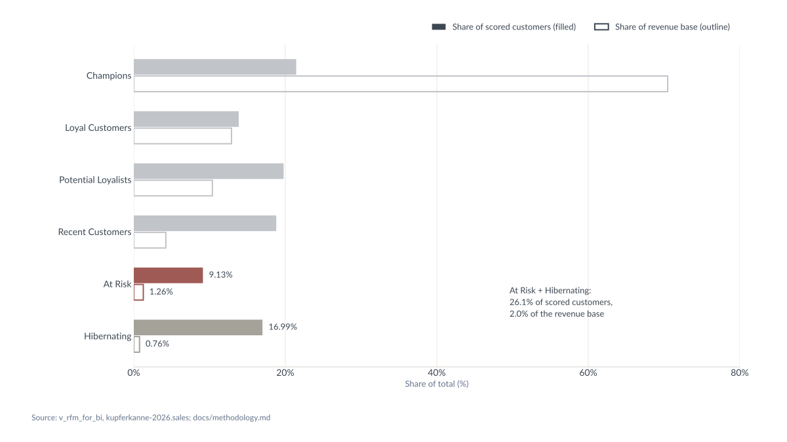
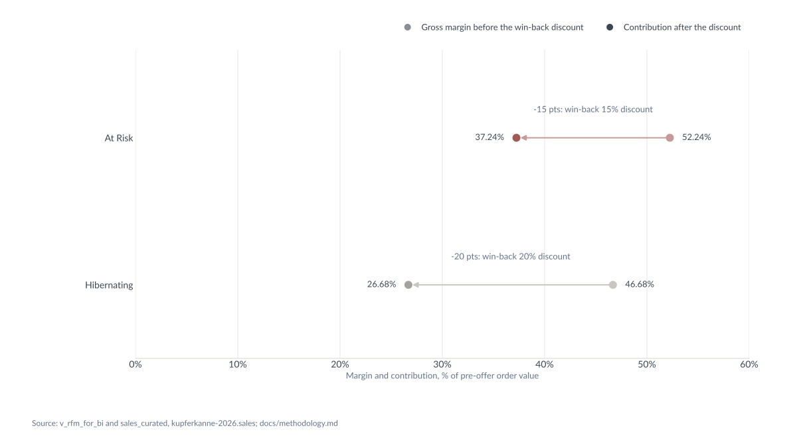
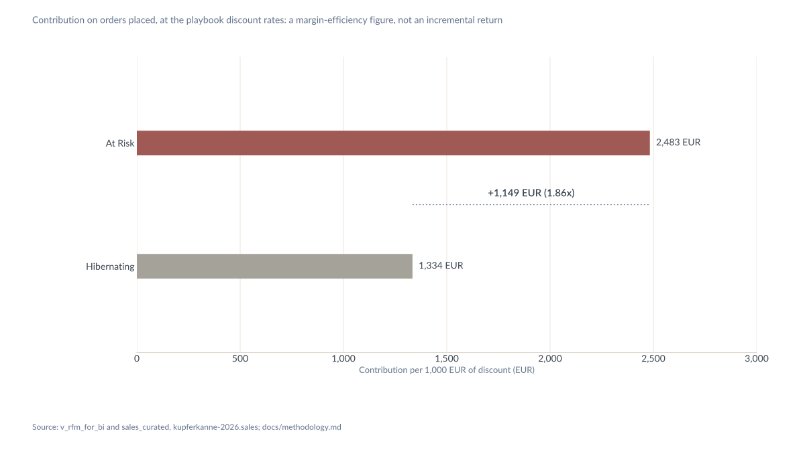

```{python}
#| label: setup
import re
import textwrap
from pathlib import Path
from types import SimpleNamespace

import matplotlib as mpl
import matplotlib.pyplot as plt
import pandas as pd
import yaml
from google.cloud import bigquery
from IPython.display import HTML, display
from matplotlib.lines import Line2D
from matplotlib.patches import Patch

PROJECT = "kupferkanne-2026"
DATASET = f"{PROJECT}.sales"
ROOT = Path.cwd().resolve().parent
METHODOLOGY = ROOT / "docs" / "methodology.md"
PLAYBOOK = (
    ROOT / "pbip" / "kupferkanne-rfm-customer-segmentation.SemanticModel"
    / "definition" / "tables" / "dim_Segment.tmdl"
)
OUT = ROOT / "docs" / "img" / "exhibits"
for path in (METHODOLOGY, PLAYBOOK):
    assert path.is_file(), f"missing {path}"
OUT.mkdir(parents=True, exist_ok=True)

client = bigquery.Client(project=PROJECT)


def query(sql: str) -> pd.DataFrame:
    """Run one read-only SELECT and return a DataFrame."""
    return client.query(sql, location="EU").to_dataframe()


# Style: the brand file is the single source for colours and fonts.
brand = yaml.safe_load(Path("_brand.yml").read_text(encoding="utf-8"))
palette = brand["color"]["palette"]
FG = brand["color"]["foreground"]
LABEL, GRID = palette["label"], palette["border"]
SEGMENT_COLOR = {
    "Champions": palette["champions"],
    "Loyal Customers": palette["loyal_customers"],
    "Potential Loyalists": palette["potential_loyalists"],
    "Recent Customers": palette["recent_customers"],
    "At Risk": palette["at_risk"],
    "Hibernating": palette["hibernating"],
}
FOCUS = ("At Risk", "Hibernating")
# Case-study headings, verbatim. Each figure rebuilds its title from live values
# and the render fails if the rebuilt title differs from the heading.
HEADING_E1 = ("A quarter of scored customers sit in At Risk or Hibernating, "
              "and their lifetime spend is 2% of the revenue base")
HEADING_E2 = ("The playbook gives the deeper discount to the thinner margin: after its offer "
              "At Risk keeps 37 points of order value, Hibernating 27")
HEADING_E3 = ("Each 1,000 EUR of discount returns 2,483 EUR of contribution in At Risk, "
              "against 1,334 EUR in Hibernating")
FONT_STACK = [f.strip() for f in brand["typography"]["base"]["family"].split(",")]
NAMED_FONTS = [f for f in FONT_STACK if f != "sans-serif"]


def tint(hex_color: str, share: float) -> str:
    """Blend a colour with white; share is the colour's part of the mix."""
    channels = [int(hex_color.lstrip("#")[i:i + 2], 16) for i in (0, 2, 4)]
    return "#" + "".join(f"{int(round(share * c + (1 - share) * 255)):02X}" for c in channels)


def _linear_rgb(hex_color: str) -> tuple:
    out = []
    for i in (0, 2, 4):
        v = int(hex_color.lstrip("#")[i:i + 2], 16) / 255
        out.append(v / 12.92 if v <= 0.04045 else ((v + 0.055) / 1.055) ** 2.4)
    return tuple(out)


def luminance(hex_color: str) -> float:
    """WCAG 2 relative luminance."""
    r, g, b = _linear_rgb(hex_color)
    return 0.2126 * r + 0.7152 * g + 0.0722 * b


def contrast(a: str, b: str) -> float:
    """WCAG 2 contrast ratio."""
    la, lb = luminance(a), luminance(b)
    return (max(la, lb) + 0.05) / (min(la, lb) + 0.05)


def oklab(hex_color: str) -> tuple:
    r, g, b = _linear_rgb(hex_color)
    l = (0.4122214708 * r + 0.5363325363 * g + 0.0514459929 * b) ** (1 / 3)
    m = (0.2119034982 * r + 0.6806995451 * g + 0.1073969566 * b) ** (1 / 3)
    s = (0.0883024619 * r + 0.2817188376 * g + 0.6299787005 * b) ** (1 / 3)
    return (0.2104542553 * l + 0.7936177850 * m - 0.0040720468 * s,
            1.9779984951 * l - 2.4285922050 * m + 0.4505937099 * s,
            0.0259040371 * l + 0.7827717662 * m - 0.8086757660 * s)


def delta_e(a: str, b: str) -> float:
    """Euclidean distance in OKLab, times 100: the scale the palette validator reports."""
    return 100 * sum((p - q) ** 2 for p, q in zip(oklab(a), oklab(b))) ** 0.5


# Context segments (the four outside FOCUS) take the foreground blended toward white:
# recessive on the darkest surface the exhibits are placed on (#F1EFE9, between 1.5:1
# and 2:1), lighter than the Hibernating fill, and at least delta E 10 from every
# segment colour so it cannot read as a seventh segment. Gridlines keep the border colour.
SURFACES = ("#FFFFFF", "#F7F5F1", "#F1EFE9")
CONTEXT_SHARE = 0.32
CONTEXT = tint(FG, CONTEXT_SHARE)
assert 1.5 <= contrast(CONTEXT, SURFACES[-1]) <= 2.0, contrast(CONTEXT, SURFACES[-1])
assert luminance(CONTEXT) > luminance(SEGMENT_COLOR["Hibernating"]), CONTEXT
assert min(delta_e(CONTEXT, c) for c in SEGMENT_COLOR.values()) >= 10, CONTEXT
# E2 "before" markers and connectors: the segment colour blended with white. A 60%
# share leaves the Hibernating tint at delta E 4.98 from the gridline; 61% is the
# first one-point step that clears the floor of 5.
TINT_SHARE = 0.61
for name in FOCUS:
    assert delta_e(tint(SEGMENT_COLOR[name], TINT_SHARE), GRID) >= 5, name


# Playbook: segment order, segment colour and win-back discount rate come from
# the semantic model, so the exhibits cannot drift from dim_Segment.
segment_rows = re.findall(
    r'\{ "([^"]+)", "[^"]*", "[^"]*", "([^"]*)", "[^"]*", (\d+), "(#[0-9A-Fa-f]{6})" \}',
    PLAYBOOK.read_text(encoding="utf-8"),
)
assert len(segment_rows) == 6, segment_rows
SEGMENT_ORDER = [row[0] for row in sorted(segment_rows, key=lambda row: int(row[2]))]
model_colors = {row[0]: row[3] for row in segment_rows}
assert model_colors == SEGMENT_COLOR, (model_colors, SEGMENT_COLOR)
DISCOUNT = {}
for name, approach, _, _ in segment_rows:
    if name in FOCUS:
        match = re.fullmatch(r"Win-back (\d+)%", approach)
        assert match, f"unexpected Discount Approach label for {name}: {approach!r}"
        DISCOUNT[name] = int(match.group(1)) / 100
assert set(DISCOUNT) == set(FOCUS), DISCOUNT

W, H = 1200, 675  # logical px: SVG viewBox 0 0 1200 675, PNG saved at 2x
mpl.rcParams.update({
    "svg.fonttype": "none",
    "svg.hashsalt": "kupferkanne-exhibits",  # fixed element ids: identical SVG bytes on every render
    "font.family": FONT_STACK,
    "font.sans-serif": NAMED_FONTS,
    "font.size": 14,
    "text.color": FG,
    "axes.labelcolor": FG,
    "xtick.color": FG,
    "ytick.color": FG,
    "axes.edgecolor": GRID,
    "axes.linewidth": 1.0,
    "axes.spines.top": False,
    "axes.spines.right": False,
    "axes.spines.left": False,
    "xtick.major.size": 0,
    "ytick.major.size": 0,
    "grid.color": GRID,
    "grid.linewidth": 1.0,
    "grid.alpha": 0.6,
    "figure.facecolor": "none",
    "axes.facecolor": "none",
    "savefig.facecolor": "none",
    "savefig.transparent": True,
})


def fmt_int(v) -> str:
    return f"{int(v):,}"


def fmt_eur(v, decimals=2) -> str:
    return f"{float(v):,.{decimals}f} EUR"


def fmt_pct(v, decimals=1) -> str:
    return f"{float(v):,.{decimals}f}%"


def show(df: pd.DataFrame) -> None:
    display(HTML(df.to_html(index=False)))


LEGEND_TOP, SUBTITLE_TOP = 0.855, 0.85  # titled layout: the header block sits under the heading
TOP_MARGIN_PX = 24  # embedded layout: the header block (legend or subtitle) starts this far down


def canvas(title: str, footer: str, rect, subtitle: str | None = None, embedded: bool = False):
    """One figure per variant on the same 1200 x 675 canvas. The titled variant bakes
    the heading in; the embedded variant has no heading band: the header block and the
    top of the axes move up so the content starts TOP_MARGIN_PX below the edge."""
    fig = plt.figure(figsize=(W / 72, H / 72))
    lines = textwrap.wrap(title, width=82)
    assert len(lines) <= 2, title
    header_top = SUBTITLE_TOP if subtitle else LEGEND_TOP
    shift = (1 - TOP_MARGIN_PX / H) - header_top if embedded else 0.0
    x, y, w, h = rect
    ax = fig.add_axes([x, y, w, h + shift])
    if not embedded:
        fig.text(0.04, 0.955, "\n".join(lines), fontsize=22, fontweight=600,
                 va="top", ha="left", linespacing=1.25)
    if subtitle:
        fig.text(0.04, header_top + shift, subtitle, fontsize=14, color=LABEL, va="top", ha="left")
    fig.text(0.04, 0.045, footer, fontsize=12, color=LABEL, va="bottom", ha="left")
    return SimpleNamespace(fig=fig, ax=ax, legend_top=LEGEND_TOP + shift, title_line=lines[0])


def legend_band(variant, handles) -> None:
    variant.fig.legend(handles=handles, loc="upper right", bbox_to_anchor=(0.94, variant.legend_top),
                       ncol=len(handles), frameon=False, fontsize=13, handlelength=1.6,
                       columnspacing=2.0)


def save_svg(fig, path: Path, embedded: bool) -> str:
    """Write the SVG with LF line endings (matplotlib writes CRLF on Windows). The
    embedded variant keeps only the viewBox on its root, so it scales to its container."""
    fig.savefig(path, format="svg", transparent=True, metadata={"Date": None})
    data = path.read_bytes().replace(b"\r\n", b"\n")
    assert b"\r" not in data, path
    root = re.search(rb"<svg[^>]*>", data).group(0)
    assert b'viewBox="0 0 1200 675"' in root, root
    if embedded:
        new_root = re.sub(rb'\s(?:width|height)="[^"]*"', b"", root)
        assert b"width=" not in new_root and b"height=" not in new_root, new_root
        data = data.replace(root, new_root, 1)
    path.write_bytes(data)
    return data.decode("utf-8")


def render(stem: str, title: str, footer: str, rect, draw, subtitle: str | None = None):
    """Draw the exhibit once per variant and save SVG and PNG for each. Returns what
    `draw` returned for the titled variant; both variants plot the same values."""
    results = []
    for embedded in (False, True):
        variant = canvas(title, footer, rect, subtitle, embedded)
        results.append(draw(variant))
        path = OUT / (stem if embedded else f"{stem}_titled")
        text = save_svg(variant.fig, path.with_suffix(".svg"), embedded)
        variant.fig.savefig(path.with_suffix(".png"), format="png", dpi=144, transparent=True)
        plt.close(variant.fig)
        assert (variant.title_line in text) == (not embedded), path
    return results[0]


FOOTER_E1 = "Source: v_rfm_for_bi, kupferkanne-2026.sales; docs/methodology.md"
FOOTER_E23 = "Source: v_rfm_for_bi and sales_curated, kupferkanne-2026.sales; docs/methodology.md"
```

```{python}
#| label: e1-query
seg = query(f"""
SELECT
    segment,
    COUNT(*) AS customers,
    SUM(order_count) AS orders,
    ROUND(SUM(total_spend), 2) AS revenue,
    ROUND(SUM(total_profit), 2) AS profit
FROM `{DATASET}.v_rfm_for_bi`
GROUP BY segment
""")
seg = seg.set_index("segment").loc[SEGMENT_ORDER].reset_index()
seg[["customers", "orders"]] = seg[["customers", "orders"]].astype(int)
seg[["revenue", "profit"]] = seg[["revenue", "profit"]].astype(float)
SCORED_CUSTOMERS = int(seg["customers"].sum())
REVENUE_BASE = round(float(seg["revenue"].sum()), 2)
seg["customer_share_pct"] = seg["customers"] / SCORED_CUSTOMERS * 100
seg["revenue_share_pct"] = seg["revenue"] / REVENUE_BASE * 100
```

```{python}
#| label: e2-query
focus = query(f"""
SELECT
    r.segment,
    COUNT(*) AS orders,
    ROUND(SUM(s.order_value), 2) AS revenue,
    ROUND(SUM(s.order_cost), 2) AS cost,
    ROUND(SUM(s.order_profit), 2) AS profit,
    ROUND(AVG(s.order_discount_pct), 4) AS mean_order_discount_pct
FROM `{DATASET}.sales_curated` AS s
INNER JOIN `{DATASET}.v_rfm_for_bi` AS r
    ON s.customer_id = r.customer_id
WHERE r.segment IN ('At Risk', 'Hibernating')
GROUP BY r.segment
""")
focus = focus.set_index("segment").loc[list(FOCUS)].reset_index()
focus["orders"] = focus["orders"].astype(int)
for col in ("revenue", "cost", "profit", "mean_order_discount_pct"):
    focus[col] = focus[col].astype(float)
focus["customers"] = focus["segment"].map(seg.set_index("segment")["customers"]).astype(int)
focus["aov"] = focus["revenue"] / focus["orders"]
focus["gross_margin"] = focus["profit"] / focus["revenue"]
focus["discount"] = focus["segment"].map(DISCOUNT)
focus["contribution"] = focus["gross_margin"] - focus["discount"]
```

```{python}
#| label: e3-query
rates = ", ".join(
    f"STRUCT('{name}' AS segment, {DISCOUNT[name]} AS discount_rate)" for name in FOCUS
)
per_1000 = query(f"""
WITH margin AS (
    SELECT
        r.segment,
        SAFE_DIVIDE(SUM(s.order_profit), SUM(s.order_value)) AS gross_margin
    FROM `{DATASET}.sales_curated` AS s
    INNER JOIN `{DATASET}.v_rfm_for_bi` AS r
        ON s.customer_id = r.customer_id
    WHERE r.segment IN ('At Risk', 'Hibernating')
    GROUP BY r.segment
)
SELECT
    m.segment,
    p.discount_rate,
    m.gross_margin,
    (m.gross_margin - p.discount_rate) / p.discount_rate AS contribution_per_eur,
    (m.gross_margin - p.discount_rate) / p.discount_rate * 1000 AS contribution_per_1000
FROM margin AS m
INNER JOIN UNNEST([{rates}]) AS p
    ON m.segment = p.segment
""")
per_1000 = per_1000.set_index("segment").loc[list(FOCUS)].reset_index()
for col in ("discount_rate", "gross_margin", "contribution_per_eur", "contribution_per_1000"):
    per_1000[col] = per_1000[col].astype(float)
RATIO = per_1000["contribution_per_eur"].iloc[0] / per_1000["contribution_per_eur"].iloc[1]
```

## Assertions against the published literals

```{python}
#| label: assertions
doc = METHODOLOGY.read_text(encoding="utf-8")


def grab(pattern: str, text: str = doc) -> tuple:
    match = re.search(pattern, text, flags=re.M)
    assert match, pattern
    return match.groups()


def num(text: str) -> float:
    return float(text.replace(",", ""))


ROW = (r"^\| {segment} \| ([\d,]+) \| ([\d,]+) \| ([\d,.]+) \| ([\d,.]+) \| ([\d,.]+) "
       r"\| ([\d.]+) \| ([\d.]+)% \| (\d+)% \| ([\d.]+) \| ([\d.]+) \|$")
COLUMNS = ("customers", "orders", "revenue", "cost", "profit", "aov", "gross_margin_pct",
           "discount_pct", "contribution_per_order", "contribution_per_eur")
published = {name: dict(zip(COLUMNS, map(num, grab(ROW.format(segment=name))))) for name in FOCUS}
p_two_customers, p_scored, p_customer_share = map(num, grab(
    r"hold ([\d,]+) of the ([\d,]+) scored customers \(([\d.]+) percent\)"))
p_two_revenue, p_revenue_share, p_base = map(num, grab(
    r"EUR ([\d,.]+) of lifetime spend, ([\d.]+) percent of the EUR ([\d,.]+) revenue base"))
p_discount = dict(zip(FOCUS, map(num, grab(
    r"`order_discount_pct` is ([\d.]+) for At Risk and ([\d.]+) for Hibernating"))))
p_per_1000 = dict(zip(FOCUS, map(num, grab(
    r"expected contribution is ([\d,]+) EUR in At Risk against ([\d,]+) EUR in Hibernating"))))
p_points = dict(zip(FOCUS, map(num, grab(
    r"At Risk retains ([\d.]+) points of contribution after a \d+-point concession; "
    r"Hibernating retains ([\d.]+) points"))))
(p_ratio,) = map(num, grab(r"At Risk returns ([\d.]+) times the contribution"))

checks = []


def check(name: str, published_value: float, live_value: float, decimals: int) -> None:
    ok = f"{live_value:.{decimals}f}" == f"{published_value:.{decimals}f}"
    checks.append({
        "Literal": name,
        "Published": f"{published_value:,.{decimals}f}",
        "Live": f"{live_value:,.{decimals}f}",
        "Result": "pass" if ok else "FAIL",
    })


def check_text(name: str, published_text: str, live_text: str) -> None:
    checks.append({
        "Literal": name,
        "Published": published_text,
        "Live": live_text,
        "Result": "pass" if published_text == live_text else "FAIL",
    })


for name in FOCUS:
    p = published[name]
    f = focus.set_index("segment").loc[name]
    k = per_1000.set_index("segment").loc[name]
    check(f"{name} customers", p["customers"], f["customers"], 0)
    check(f"{name} orders", p["orders"], f["orders"], 0)
    check(f"{name} revenue", p["revenue"], f["revenue"], 2)
    check(f"{name} cost", p["cost"], f["cost"], 2)
    check(f"{name} profit", p["profit"], f["profit"], 2)
    check(f"{name} AOV", p["aov"], f["aov"], 2)
    check(f"{name} gross margin %", p["gross_margin_pct"], f["gross_margin"] * 100, 4)
    check(f"{name} discount %", p["discount_pct"], f["discount"] * 100, 0)
    check(f"{name} contribution per order", p["contribution_per_order"],
          f["aov"] * f["contribution"], 2)
    check(f"{name} contribution per euro of discount", p["contribution_per_eur"],
          k["contribution_per_eur"], 4)
    check(f"{name} contribution per 1,000 EUR of discount", p_per_1000[name],
          k["contribution_per_1000"], 0)
    check(f"{name} retained points after discount", p_points[name], f["contribution"] * 100, 4)
    check(f"{name} mean order_discount_pct", p_discount[name], f["mean_order_discount_pct"], 4)
    s = seg.set_index("segment").loc[name]
    check(f"{name} lifetime spend (v_rfm_for_bi)", p["revenue"], s["revenue"], 2)

two = focus.set_index("segment").loc[list(FOCUS)]
check("At Risk + Hibernating customers", p_two_customers, two["customers"].sum(), 0)
check("Scored customers", p_scored, SCORED_CUSTOMERS, 0)
check("At Risk + Hibernating share of scored customers %", p_customer_share,
      two["customers"].sum() / SCORED_CUSTOMERS * 100, 1)
check("At Risk + Hibernating lifetime spend", p_two_revenue, two["revenue"].sum(), 2)
check("Revenue base", p_base, REVENUE_BASE, 2)
check("At Risk + Hibernating share of revenue base %", p_revenue_share,
      two["revenue"].sum() / REVENUE_BASE * 100, 1)
check("At Risk / Hibernating contribution ratio", p_ratio, RATIO, 2)

# Segment-share table appended to docs/methodology.md: every row and the closing
# sentence must equal the same strings built from the live v_rfm_for_bi result.
SHARE_HEADING = "## Appendix: segment shares"
assert doc.count(SHARE_HEADING) == 1, SHARE_HEADING
share_section = doc.split(SHARE_HEADING, 1)[1]
share_rows = re.findall(r"^\| (?!Segment|---)([^|]+?) \| ([^|]+) \| ([^|]+) \| ([^|]+) \| ([^|]+) \|$",
                        share_section, flags=re.M)
share_doc = {row[0]: "| " + " | ".join(row) + " |" for row in share_rows}
assert list(share_doc) == SEGMENT_ORDER + ["Total"], list(share_doc)
for row in seg.itertuples():
    live_row = (f"| {row.segment} | {fmt_int(row.customers)} | {fmt_pct(row.customer_share_pct, 2)} "
                f"| {row.revenue:,.2f} | {fmt_pct(row.revenue_share_pct, 2)} |")
    check_text(f"Segment shares table row: {row.segment}", share_doc[row.segment], live_row)
check_text("Segment shares table row: Total", share_doc["Total"],
           f"| Total | {fmt_int(SCORED_CUSTOMERS)} | 100.00% | {REVENUE_BASE:,.2f} | 100.00% |")
(p_share_sentence,) = grab(r"^(Figures come from v_rfm_for_bi .*)$", share_section)
check_text("Segment shares closing sentence", p_share_sentence,
           "Figures come from v_rfm_for_bi at the segment snapshot and are the source of the "
           f"segment-share exhibit; At Risk and Hibernating total {fmt_int(two['customers'].sum())} "
           f"customers and {two['revenue'].sum():,.2f} EUR.")

show(pd.DataFrame(checks))
failed = [c["Literal"] for c in checks if c["Result"] != "pass"]
assert not failed, f"live results differ from docs/methodology.md: {failed}"
```

```{python}
#| label: e1-heading
#| output: asis
print(f"## {HEADING_E1}")
```

Share of scored customers and share of the revenue base per segment from `v_rfm_for_bi`; At Risk and Hibernating carry their segment colours, the other four segments are context.

```{python}
#| label: e1-table
e1 = seg.copy()
show(pd.DataFrame({
    "Segment": list(e1["segment"]) + ["Total"],
    "Customers": list(e1["customers"].map(fmt_int)) + [fmt_int(SCORED_CUSTOMERS)],
    "Share of scored customers": list(e1["customer_share_pct"].map(lambda v: fmt_pct(v, 2))) + [fmt_pct(100, 2)],
    "Lifetime spend": list(e1["revenue"].map(fmt_eur)) + [fmt_eur(REVENUE_BASE)],
    "Share of revenue base": list(e1["revenue_share_pct"].map(lambda v: fmt_pct(v, 2))) + [fmt_pct(100, 2)],
}))
```

```{python}
#| label: e1-figure
two_customers = e1.loc[e1["segment"].isin(FOCUS), "customer_share_pct"].sum()
two_revenue = e1.loc[e1["segment"].isin(FOCUS), "revenue_share_pct"].sum()
title = (f"A quarter of scored customers sit in At Risk or Hibernating, "
         f"and their lifetime spend is {two_revenue:.0f}% of the revenue base")
assert title == HEADING_E1, title
assert abs(two_customers - 25) <= 2.5, two_customers  # "a quarter"
total_customers_label, total_revenue_label = fmt_pct(two_customers), fmt_pct(two_revenue)


def draw_e1(variant):
    ax = variant.ax
    n = len(e1)
    bar = 0.30
    gap = 2 / (ax.get_position().height * H) * n  # 2px surface gap between the paired bars, in data units
    ys = list(range(n))[::-1]
    displayed = []
    for y, row in zip(ys, e1.itertuples()):
        hi = row.segment in FOCUS
        color = SEGMENT_COLOR[row.segment] if hi else CONTEXT
        y_cust, y_rev = y + bar / 2 + gap / 2, y - bar / 2 - gap / 2
        ax.barh(y_cust, row.customer_share_pct, height=bar, color=color, edgecolor="none", zorder=3)
        ax.barh(y_rev, row.revenue_share_pct, height=bar, facecolor="none", edgecolor=color,
                linewidth=2.0, zorder=3)
        if hi:
            customers_label, revenue_label = fmt_pct(row.customer_share_pct, 2), fmt_pct(row.revenue_share_pct, 2)
            ax.text(row.customer_share_pct + 0.8, y_cust, customers_label, va="center", ha="left", fontsize=13)
            ax.text(row.revenue_share_pct + 0.8, y_rev, revenue_label, va="center", ha="left", fontsize=13)
            displayed.append({"Segment": row.segment, "Customers label": customers_label,
                              "Revenue label": revenue_label})
    ax.set_yticks(ys)
    ax.set_yticklabels(e1["segment"], fontsize=14)
    ax.set_xlim(0, 80)
    ax.set_xticks(range(0, 81, 20))
    ax.set_xticklabels([fmt_pct(v, 0) for v in range(0, 81, 20)])
    ax.grid(axis="x", zorder=0)
    ax.set_axisbelow(True)
    ax.set_xlabel("Share of total (%)", fontsize=13, color=LABEL)
    ax.annotate(
        f"At Risk + Hibernating:\n{total_customers_label} of scored customers,\n"
        f"{total_revenue_label} of the revenue base",
        xy=(0.62, 0.20), xycoords="axes fraction", fontsize=13, ha="left", va="center",
        linespacing=1.4,
    )
    legend_band(variant, [
        Patch(facecolor=FG, label="Share of scored customers (filled)"),
        Patch(facecolor="none", edgecolor=FG, linewidth=2.0, label="Share of revenue base (outline)"),
    ])
    return displayed


displayed = render("e1_segment_share", title, FOOTER_E1, [0.17, 0.17, 0.77, 0.62], draw_e1)
# The displayed labels, summed and rounded to 1 dp, must equal the displayed totals.
label_sum_customers = sum(float(d["Customers label"].rstrip("%")) for d in displayed)
label_sum_revenue = sum(float(d["Revenue label"].rstrip("%")) for d in displayed)
assert fmt_pct(label_sum_customers) == total_customers_label, (label_sum_customers, total_customers_label)
assert fmt_pct(label_sum_revenue) == total_revenue_label, (label_sum_revenue, total_revenue_label)
show(pd.DataFrame(displayed + [{"Segment": "Displayed total", "Customers label": total_customers_label,
                                "Revenue label": total_revenue_label}]))
```

{width="100%" fig-alt="A quarter of scored customers sit in At Risk or Hibernating, and their lifetime spend is 2% of the revenue base"}

```{python}
#| label: e2-heading
#| output: asis
print(f"## {HEADING_E2}")
```

Realised gross margin before the playbook's win-back discount and contribution after it, in points of order value; the discount rate is the `dim_Segment[Discount Approach]` label.

```{python}
#| label: e2-table
show(pd.DataFrame({
    "Segment": focus["segment"],
    "Customers": focus["customers"].map(fmt_int),
    "Orders": focus["orders"].map(fmt_int),
    "Revenue": focus["revenue"].map(fmt_eur),
    "Cost": focus["cost"].map(fmt_eur),
    "Profit": focus["profit"].map(fmt_eur),
    "AOV": focus["aov"].map(fmt_eur),
    "Gross margin": (focus["gross_margin"] * 100).map(lambda v: fmt_pct(v, 4)),
    "Mean realised discount": (focus["mean_order_discount_pct"] * 100).map(lambda v: fmt_pct(v, 2)),
    "Win-back discount": (focus["discount"] * 100).map(lambda v: fmt_pct(v, 0)),
    "Contribution after discount (points)": (focus["contribution"] * 100).map(lambda v: f"{v:.4f}"),
}))
```

```{python}
#| label: e2-figure
points = dict(zip(focus["segment"], focus["contribution"] * 100))
title = (f"The playbook gives the deeper discount to the thinner margin: after its offer "
         f"At Risk keeps {points['At Risk']:.0f} points of order value, "
         f"Hibernating {points['Hibernating']:.0f}")
assert title == HEADING_E2, title


def draw_e2(variant):
    ax = variant.ax
    ys = [1, 0]
    tints = []
    for y, row in zip(ys, focus.itertuples()):
        color = SEGMENT_COLOR[row.segment]
        light = tint(color, TINT_SHARE)
        tints.append({"Segment": row.segment, "Before (tint)": light, "After (full)": color,
                      "Tint contrast on white": f"{contrast(light, '#FFFFFF'):.2f}:1",
                      "Tint delta E vs gridline": f"{delta_e(light, GRID):.2f}"})
        before, after, drop = row.gross_margin * 100, row.contribution * 100, row.discount * 100
        ax.annotate("", xy=(after, y), xytext=(before, y),
                    arrowprops=dict(arrowstyle="-|>", color=light, linewidth=2, shrinkA=6, shrinkB=6,
                                    mutation_scale=16), zorder=2)
        ax.plot([before], [y], marker="o", markersize=12, markerfacecolor=light,
                markeredgecolor="none", linestyle="none", zorder=3)
        ax.plot([after], [y], marker="o", markersize=12, markerfacecolor=color,
                markeredgecolor="none", linestyle="none", zorder=4)
        ax.text(before + 1.2, y, fmt_pct(before, 2), va="center", ha="left", fontsize=13)
        ax.text(after - 1.2, y, fmt_pct(after, 2), va="center", ha="right", fontsize=13)
        ax.text((before + after) / 2, y + 0.16, f"-{drop:.0f} pts: win-back {drop:.0f}% discount",
                va="bottom", ha="center", fontsize=13, color=LABEL)
    ax.set_yticks(ys)
    ax.set_yticklabels(focus["segment"], fontsize=14)
    ax.set_ylim(-0.5, 1.6)
    ax.set_xlim(0, 60)
    ax.set_xticks(range(0, 61, 10))
    ax.set_xticklabels([fmt_pct(v, 0) for v in range(0, 61, 10)])
    ax.grid(axis="x", zorder=0)
    ax.set_axisbelow(True)
    ax.set_xlabel("Margin and contribution, % of pre-offer order value", fontsize=13, color=LABEL)
    legend_band(variant, [
        Line2D([], [], marker="o", markersize=10, markerfacecolor=tint(FG, TINT_SHARE),
               markeredgecolor="none", linestyle="none", label="Gross margin before the win-back discount"),
        Line2D([], [], marker="o", markersize=10, markerfacecolor=FG, markeredgecolor="none",
               linestyle="none", label="Contribution after the discount"),
    ])
    return tints


tints = render("e2_margin_after_discount", title, FOOTER_E23, [0.17, 0.20, 0.77, 0.58], draw_e2)
show(pd.DataFrame(tints))
```

{width="100%" fig-alt="The playbook gives the deeper discount to the thinner margin: after its offer At Risk keeps 37 points of order value, Hibernating 27"}

```{python}
#| label: e3-heading
#| output: asis
print(f"## {HEADING_E3}")
```

Contribution per 1,000 EUR of discount at the playbook rates: (gross margin - discount rate) / discount rate x 1,000 EUR.

```{python}
#| label: e3-table
show(pd.DataFrame({
    "Segment": per_1000["segment"],
    "Gross margin": (per_1000["gross_margin"] * 100).map(lambda v: fmt_pct(v, 4)),
    "Win-back discount": (per_1000["discount_rate"] * 100).map(lambda v: fmt_pct(v, 0)),
    "Contribution per EUR of discount": per_1000["contribution_per_eur"].map(lambda v: f"{v:.4f}"),
    "Contribution per 1,000 EUR of discount": per_1000["contribution_per_1000"].map(lambda v: fmt_eur(v, 0)),
}))
```

```{python}
#| label: e3-figure
per_1000_by_segment = dict(zip(per_1000["segment"], per_1000["contribution_per_1000"]))
title = (f"Each 1,000 EUR of discount returns {per_1000_by_segment['At Risk']:,.0f} EUR of "
         f"contribution in At Risk, against {per_1000_by_segment['Hibernating']:,.0f} EUR in Hibernating")
assert title == HEADING_E3, title


def draw_e3(variant):
    ax = variant.ax
    ys = [1, 0]
    values = list(per_1000["contribution_per_1000"])
    for y, row in zip(ys, per_1000.itertuples()):
        ax.barh(y, row.contribution_per_1000, height=0.2, color=SEGMENT_COLOR[row.segment],
                edgecolor="none", zorder=3)
        ax.text(row.contribution_per_1000 + 30, y, fmt_eur(row.contribution_per_1000, 0),
                va="center", ha="left", fontsize=14)
    ax.plot([values[1], values[0]], [0.5, 0.5], color=LABEL, linewidth=1, linestyle=(0, (2, 3)), zorder=2)
    ax.text((values[0] + values[1]) / 2, 0.55, f"+{values[0] - values[1]:,.0f} EUR ({RATIO:.2f}x)",
            va="bottom", ha="center", fontsize=15, fontweight=600)
    ax.set_yticks(ys)
    ax.set_yticklabels(per_1000["segment"], fontsize=14)
    ax.set_ylim(-0.7, 1.7)
    ax.set_xlim(0, 3000)
    ax.set_xticks(range(0, 3001, 500))
    ax.set_xticklabels([f"{v:,}" for v in range(0, 3001, 500)])
    ax.grid(axis="x", zorder=0)
    ax.set_axisbelow(True)
    ax.set_xlabel("Contribution per 1,000 EUR of discount (EUR)", fontsize=13, color=LABEL)


render("e3_contribution_per_1000", title, FOOTER_E23, [0.17, 0.22, 0.77, 0.54], draw_e3,
       subtitle="Contribution on orders placed, at the playbook discount rates: "
                "a margin-efficiency figure, not an incremental return")
```

{width="100%" fig-alt="Each 1,000 EUR of discount returns 2,483 EUR of contribution in At Risk, against 1,334 EUR in Hibernating"}
